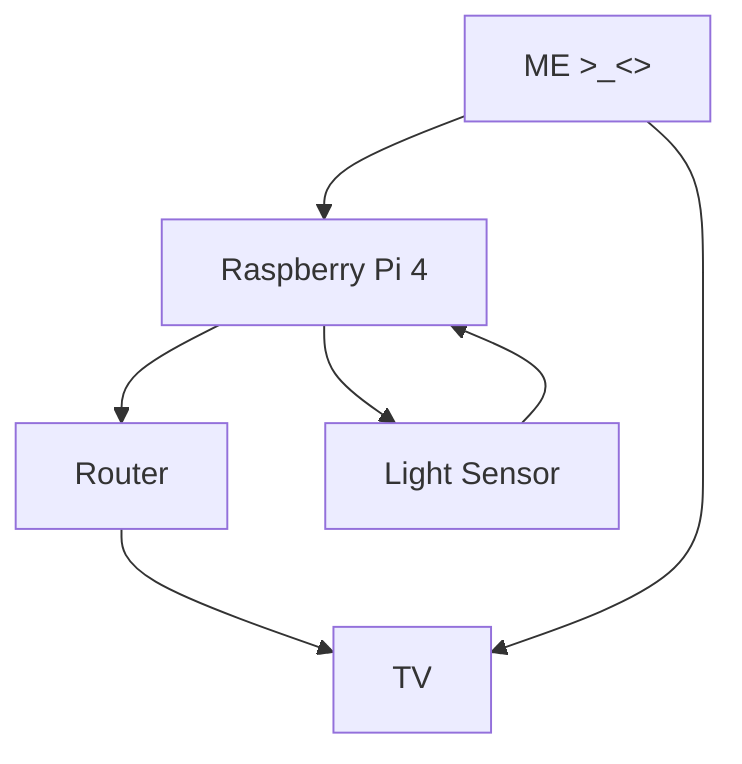
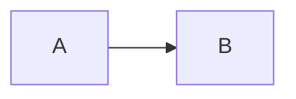

# EGL315-2023-Prac

## Name
Abbie Ng Xin Yi (Normal)

*Abbie Ng Xin Yi* (Italics)

**Abbie Ng Xin Yi** (Bold)

***Abbie Ng Xin Yi*** (Italics & Bold)

## School
### There are two options to insert codes

### Code Block
```
I am at Nanyang Polytechnic
Block S
Room 540
```

### Code Line
`sudo raspi-config`

### Adding a Picture

I'm Bocchi!


## Block Diagram
### TD stands for Top Down (Top to Bottom)


### LR stands for Left to Right

